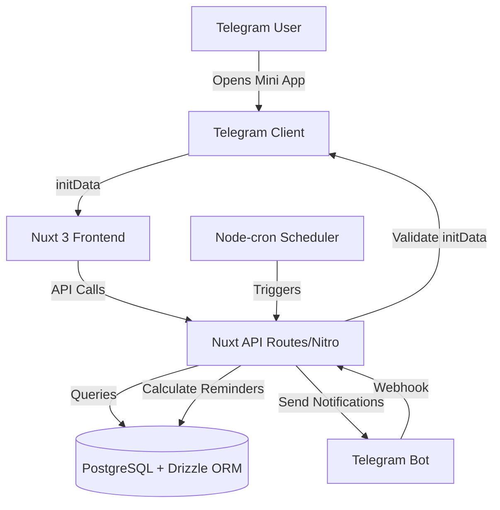
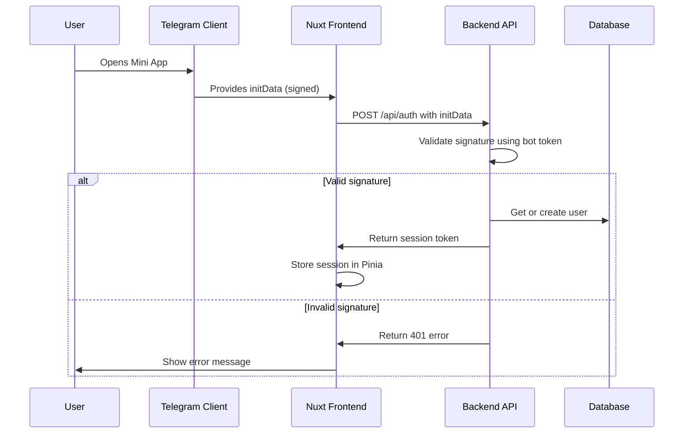

# Design Document: Nudge Telegram Mini App

## Overview

Nudge is a Telegram Mini App built with Nuxt 3 that helps users maintain social and professional connections through intelligent reminders and gamification. The application follows a modern full-stack architecture with server-side rendering capabilities, PostgreSQL database, and integration with Telegram Bot API for notifications.

The system is designed around three core pillars:
1. **Contact Management** - Import, track, and configure communication preferences
2. **Reminder System** - Automated calculation and delivery of timely notifications
3. **Gamification** - Streaks, XP, levels, and achievements to motivate consistent engagement

## Architecture

### High-Level Architecture



### Technology Stack

**Frontend:**
- Nuxt 3 (SSR/SSG with Vue 3 Composition API)
- TypeScript (strict mode)
- UnoCSS for styling
- Pinia for state management
- Telegram Web App SDK

**Backend:**
- Nuxt API Routes (Nitro server)
- Drizzle ORM with PostgreSQL
- Node-cron for scheduling
- Telegram Bot API

**Testing:**
- Vitest for unit tests
- fast-check for property-based testing

### Authentication Flow



## Components and Interfaces

### Frontend Components

**Pages:**
- `pages/index.vue` - Dashboard with today's reminders, streak, XP, level
- `pages/contacts.vue` - Contact list with search and filtering
- `pages/contacts/[id].vue` - Contact detail page with settings and history
- `pages/achievements.vue` - Achievements and progress visualization
- `pages/settings.vue` - App settings and preferences

**Composables:**
- `useTelegramAuth()` - Handle Telegram authentication and initData
- `useContacts()` - Contact management logic (CRUD operations)
- `useReminders()` - Reminder fetching and completion
- `useGamification()` - Streak, XP, level, and achievement logic
- `useNotifications()` - UI notification system

**Stores (Pinia):**
- `useAuthStore()` - User authentication state
- `useContactStore()` - Contact data and operations
- `useReminderStore()` - Reminder state
- `useGamificationStore()` - Gamification state (streak, XP, level, achievements)

### Backend API Routes

**Authentication:**
- `POST /api/auth` - Validate initData and create/retrieve user session

**Contacts:**
- `GET /api/contacts` - Get all user contacts
- `POST /api/contacts` - Add new contact
- `PUT /api/contacts/:id` - Update contact settings
- `DELETE /api/contacts/:id` - Remove contact
- `GET /api/contacts/:id` - Get contact details

**Reminders:**
- `GET /api/reminders` - Get today's reminders
- `POST /api/reminders/:id/complete` - Mark reminder as completed

**Gamification:**
- `GET /api/gamification/stats` - Get user stats (streak, XP, level)
- `GET /api/gamification/achievements` - Get all achievements with unlock status

**Webhook:**
- `POST /api/webhook` - Handle Telegram Bot webhook events

**Scheduler:**
- Internal cron job (not exposed as API) - Calculate and send reminders

### Core Interfaces

```typescript
interface User {
  id: number
  telegramId: string
  username: string | null
  firstName: string | null
  lastName: string | null
  currentStreak: number
  longestStreak: number
  totalXP: number
  level: number
  createdAt: Date
  updatedAt: Date
}

interface Contact {
  id: number
  userId: number
  telegramContactId: string
  name: string
  username: string | null
  isTracked: boolean
  frequency: 'weekly' | 'monthly' | 'quarterly' | 'custom'
  customFrequencyDays: number | null
  communicationType: 'message' | 'call' | 'meeting'
  category: 'family' | 'friends' | 'colleagues' | 'business'
  lastContactDate: Date | null
  nextReminderDate: Date | null
  createdAt: Date
  updatedAt: Date
}

interface Reminder {
  id: number
  userId: number
  contactId: number
  dueDate: Date
  completed: boolean
  completedAt: Date | null
  notificationSent: boolean
  createdAt: Date
}

interface Achievement {
  id: number
  code: string
  name: string
  description: string
  icon: string
  xpReward: number
  criteria: Record<string, any>
}

interface UserAchievement {
  id: number
  userId: number
  achievementId: number
  unlockedAt: Date
}

interface ActivityLog {
  id: number
  userId: number
  action: 'contact_added' | 'reminder_completed' | 'streak_maintained' | 'achievement_unlocked'
  xpAwarded: number
  metadata: Record<string, any>
  createdAt: Date
}
```

## Data Models

### Database Schema (Drizzle ORM)

```typescript
// users table
export const users = pgTable('users', {
  id: serial('id').primaryKey(),
  telegramId: varchar('telegram_id', { length: 255 }).notNull().unique(),
  username: varchar('username', { length: 255 }),
  firstName: varchar('first_name', { length: 255 }),
  lastName: varchar('last_name', { length: 255 }),
  currentStreak: integer('current_streak').notNull().default(0),
  longestStreak: integer('longest_streak').notNull().default(0),
  totalXP: integer('total_xp').notNull().default(0),
  level: integer('level').notNull().default(1),
  lastActivityDate: timestamp('last_activity_date'),
  createdAt: timestamp('created_at').notNull().defaultNow(),
  updatedAt: timestamp('updated_at').notNull().defaultNow()
})

// contacts table
export const contacts = pgTable('contacts', {
  id: serial('id').primaryKey(),
  userId: integer('user_id').notNull().references(() => users.id, { onDelete: 'cascade' }),
  telegramContactId: varchar('telegram_contact_id', { length: 255 }).notNull(),
  name: varchar('name', { length: 255 }).notNull(),
  username: varchar('username', { length: 255 }),
  isTracked: boolean('is_tracked').notNull().default(false),
  frequency: varchar('frequency', { length: 50 }).notNull().default('monthly'),
  customFrequencyDays: integer('custom_frequency_days'),
  communicationType: varchar('communication_type', { length: 50 }).notNull().default('message'),
  category: varchar('category', { length: 50 }).notNull().default('friends'),
  lastContactDate: timestamp('last_contact_date'),
  nextReminderDate: timestamp('next_reminder_date'),
  createdAt: timestamp('created_at').notNull().defaultNow(),
  updatedAt: timestamp('updated_at').notNull().defaultNow()
})

// reminders table
export const reminders = pgTable('reminders', {
  id: serial('id').primaryKey(),
  userId: integer('user_id').notNull().references(() => users.id, { onDelete: 'cascade' }),
  contactId: integer('contact_id').notNull().references(() => contacts.id, { onDelete: 'cascade' }),
  dueDate: timestamp('due_date').notNull(),
  completed: boolean('completed').notNull().default(false),
  completedAt: timestamp('completed_at'),
  notificationSent: boolean('notification_sent').notNull().default(false),
  createdAt: timestamp('created_at').notNull().defaultNow()
})

// achievements table
export const achievements = pgTable('achievements', {
  id: serial('id').primaryKey(),
  code: varchar('code', { length: 100 }).notNull().unique(),
  name: varchar('name', { length: 255 }).notNull(),
  description: text('description').notNull(),
  icon: varchar('icon', { length: 100 }).notNull(),
  xpReward: integer('xp_reward').notNull().default(0),
  criteria: jsonb('criteria').notNull()
})

// user_achievements table
export const userAchievements = pgTable('user_achievements', {
  id: serial('id').primaryKey(),
  userId: integer('user_id').notNull().references(() => users.id, { onDelete: 'cascade' }),
  achievementId: integer('achievement_id').notNull().references(() => achievements.id, { onDelete: 'cascade' }),
  unlockedAt: timestamp('unlocked_at').notNull().defaultNow()
})

// activity_logs table
export const activityLogs = pgTable('activity_logs', {
  id: serial('id').primaryKey(),
  userId: integer('user_id').notNull().references(() => users.id, { onDelete: 'cascade' }),
  action: varchar('action', { length: 100 }).notNull(),
  xpAwarded: integer('xp_awarded').notNull().default(0),
  metadata: jsonb('metadata'),
  createdAt: timestamp('created_at').notNull().defaultNow()
})
```

### Business Logic

**Reminder Calculation:**
```typescript
function calculateNextReminderDate(contact: Contact): Date {
  const baseDate = contact.lastContactDate || contact.createdAt
  const daysToAdd = getFrequencyInDays(contact.frequency, contact.customFrequencyDays)
  return addDays(baseDate, daysToAdd)
}

function getFrequencyInDays(frequency: string, customDays: number | null): number {
  switch (frequency) {
    case 'weekly': return 7
    case 'monthly': return 30
    case 'quarterly': return 90
    case 'custom': return customDays || 30
    default: return 30
  }
}
```

**XP and Level System:**
```typescript
const XP_REWARDS = {
  CONTACT_ADDED: 10,
  REMINDER_COMPLETED: 20,
  STREAK_MAINTAINED: 5,
  ACHIEVEMENT_UNLOCKED: 50
}

function calculateLevel(totalXP: number): number {
  // Level formula: level = floor(sqrt(totalXP / 100)) + 1
  return Math.floor(Math.sqrt(totalXP / 100)) + 1
}

function getXPForNextLevel(currentLevel: number): number {
  return (currentLevel * currentLevel) * 100
}
```

**Streak Logic:**
```typescript
function updateStreak(user: User, completedToday: boolean): User {
  const today = startOfDay(new Date())
  const lastActivity = user.lastActivityDate ? startOfDay(user.lastActivityDate) : null
  
  if (!lastActivity) {
    // First activity
    return {
      ...user,
      currentStreak: 1,
      longestStreak: Math.max(1, user.longestStreak),
      lastActivityDate: today
    }
  }
  
  const daysSinceLastActivity = differenceInDays(today, lastActivity)
  
  if (daysSinceLastActivity === 0) {
    // Already completed today
    return user
  } else if (daysSinceLastActivity === 1) {
    // Consecutive day
    const newStreak = user.currentStreak + 1
    return {
      ...user,
      currentStreak: newStreak,
      longestStreak: Math.max(newStreak, user.longestStreak),
      lastActivityDate: today
    }
  } else {
    // Streak broken
    return {
      ...user,
      currentStreak: 1,
      lastActivityDate: today
    }
  }
}
```

## Correctness Properties

*A property is a characteristic or behavior that should hold true across all valid executions of a system—essentially, a formal statement about what the system should do. Properties serve as the bridge between human-readable specifications and machine-verifiable correctness guarantees.*


### Property 1: Authentication Signature Validation

*For any* initData with a valid HMAC-SHA256 signature computed using the bot token, the authentication validation should succeed and return the user's Telegram ID.

**Validates: Requirements 1.1, 1.2**

### Property 2: Contact Data Persistence Round-Trip

*For any* contact with valid configuration (name, frequency, communication type, category), storing the contact and then retrieving it should return an equivalent contact object with all fields preserved.

**Validates: Requirements 1.4, 2.6, 6.1**

### Property 3: Contact Configuration Validation

*For any* contact being configured, setting a valid frequency option (weekly, monthly, quarterly, custom), communication type (message, call, meeting), or category (family, friends, colleagues, business) should be accepted and persisted correctly.

**Validates: Requirements 2.3, 2.4, 2.5**

### Property 4: Reminder Calculation Consistency

*For any* tracked contact with a configured frequency and last interaction date, calculating the next reminder date should consistently follow the formula: nextReminderDate = lastContactDate + frequencyInDays.

**Validates: Requirements 3.1, 7.1**

### Property 5: Due Contact Identification

*For any* set of contacts, those with nextReminderDate <= today should appear in today's reminder list, and those with nextReminderDate > today should not appear.

**Validates: Requirements 3.2, 3.4**

### Property 6: Reminder Completion Effects

*For any* reminder that is marked as completed, the associated contact's lastContactDate should be updated to today, and the contact should be removed from today's reminder list.

**Validates: Requirements 3.5, 3.6**

### Property 7: Streak Calculation Logic

*For any* user with a lastActivityDate, completing a reminder should:
- Increment currentStreak by 1 if lastActivityDate was yesterday
- Set currentStreak to 1 if lastActivityDate was more than 1 day ago
- Leave currentStreak unchanged if lastActivityDate is today
- Update longestStreak if currentStreak exceeds it

**Validates: Requirements 4.1, 4.2**

### Property 8: XP Award Consistency

*For any* tracked action (contact_added, reminder_completed, streak_maintained, achievement_unlocked), the system should award the predefined XP amount for that action type, and the user's totalXP should increase by exactly that amount.

**Validates: Requirements 4.3, 4.4, 4.5, 4.6**

### Property 9: Level Calculation Formula

*For any* totalXP value, the user's level should be calculated as floor(sqrt(totalXP / 100)) + 1, ensuring consistent level progression.

**Validates: Requirements 4.7**

### Property 10: Achievement Unlock Criteria

*For any* achievement with defined criteria and any user state, if the user's data satisfies all criteria conditions, the achievement should be unlocked and added to userAchievements.

**Validates: Requirements 4.8**

### Property 11: Activity Aggregation Accuracy

*For any* time period (week or month) and any set of activity logs, the count of completed reminders should equal the number of activity logs with action='reminder_completed' within that period.

**Validates: Requirements 5.2**

### Property 12: Data Persistence Across Sessions

*For any* user data (contacts, settings, streaks, XP, achievements), closing and reopening the application should restore all data with no loss or corruption.

**Validates: Requirements 6.2**

### Property 13: Webhook Signature Validation

*For any* webhook request with a valid signature computed using the bot token, the validation should succeed; for any webhook with an invalid or missing signature, validation should fail and the request should be rejected.

**Validates: Requirements 9.2**

### Property 14: Bot Command Processing

*For any* valid completion command received via webhook (e.g., "/done @username"), the system should identify the corresponding reminder and mark it as completed.

**Validates: Requirements 9.3**

## Error Handling

### Authentication Errors
- Invalid or tampered initData → Return 401 with error message
- Missing required fields in initData → Return 400 with validation error
- Bot token not configured → Return 500 with configuration error

### Contact Management Errors
- Duplicate contact import → Skip duplicate, log warning
- Invalid frequency/type/category → Return 400 with validation error
- Contact not found → Return 404 with error message
- Database connection failure → Return 503 with retry message

### Reminder System Errors
- Reminder calculation failure → Log error, skip contact, continue processing
- Notification send failure → Log error, mark notification as failed, retry later
- Invalid reminder ID → Return 404 with error message

### Gamification Errors
- Achievement criteria evaluation error → Log error, skip achievement check
- XP calculation overflow → Cap at maximum safe integer
- Invalid achievement code → Return 404 with error message

### Webhook Errors
- Invalid signature → Return 401, log security event
- Malformed payload → Return 400 with validation error
- Unknown command → Return 400 with supported commands list

### General Error Handling Principles
1. All errors should be logged with sufficient context for debugging
2. User-facing errors should be clear and actionable
3. Sensitive information (tokens, signatures) should never be exposed in error messages
4. Database errors should trigger automatic retry with exponential backoff
5. External API failures (Telegram) should be handled gracefully with fallback behavior

## Testing Strategy

### Dual Testing Approach

This project will use both unit testing and property-based testing to ensure comprehensive coverage:

**Unit Tests:**
- Verify specific examples and edge cases
- Test integration points between components
- Validate error conditions and error messages
- Test UI component rendering with specific data
- Test API endpoint responses with known inputs

**Property-Based Tests:**
- Verify universal properties across all inputs
- Test business logic with randomized data
- Validate data transformations and calculations
- Ensure consistency of core algorithms
- Test round-trip properties (serialization, database operations)

### Property-Based Testing with fast-check

We will use [fast-check](https://fast-check.dev/) as our property-based testing library for TypeScript. fast-check integrates seamlessly with Vitest and provides powerful generators for creating random test data.

**Configuration:**
- Each property test must run a minimum of 100 iterations
- Tests should use appropriate arbitraries (generators) for data types
- Each test must reference its design document property in a comment
- Tag format: `// Feature: nudge-telegram-app, Property {number}: {property_text}`

**Example Property Test Structure:**
```typescript
import { describe, it, expect } from 'vitest'
import * as fc from 'fast-check'

describe('Reminder Calculation', () => {
  it('should calculate next reminder date consistently', () => {
    // Feature: nudge-telegram-app, Property 4: Reminder Calculation Consistency
    fc.assert(
      fc.property(
        fc.date(),
        fc.constantFrom('weekly', 'monthly', 'quarterly'),
        (lastContactDate, frequency) => {
          const nextDate = calculateNextReminderDate({ lastContactDate, frequency })
          const expectedDays = getFrequencyInDays(frequency)
          const actualDays = differenceInDays(nextDate, lastContactDate)
          expect(actualDays).toBe(expectedDays)
        }
      ),
      { numRuns: 100 }
    )
  })
})
```

### Test Coverage Goals

**Unit Tests:**
- API route handlers: 100% coverage
- Business logic functions: 100% coverage
- Composables: 90% coverage
- UI components: 80% coverage (focus on logic, not styling)

**Property Tests:**
- All 14 correctness properties must have corresponding property tests
- Each property test must validate the universal behavior described in the design
- Property tests should complement unit tests, not replace them

### Testing Best Practices

1. **Isolation**: Each test should be independent and not rely on external state
2. **Clarity**: Test names should clearly describe what is being tested
3. **Speed**: Tests should run quickly; use mocks for external dependencies
4. **Determinism**: Tests should produce consistent results (use seeded randomness for property tests)
5. **Maintainability**: Tests should be easy to understand and modify

### Test Organization

```
tests/
├── unit/
│   ├── api/
│   │   ├── auth.test.ts
│   │   ├── contacts.test.ts
│   │   └── reminders.test.ts
│   ├── composables/
│   │   ├── useTelegramAuth.test.ts
│   │   └── useGamification.test.ts
│   └── utils/
│       ├── calculations.test.ts
│       └── validation.test.ts
└── properties/
    ├── authentication.property.test.ts
    ├── contacts.property.test.ts
    ├── reminders.property.test.ts
    ├── gamification.property.test.ts
    └── persistence.property.test.ts
```

### Continuous Integration

- All tests must pass before merging to main branch
- Property tests run with fixed seed in CI for reproducibility
- Test coverage reports generated and tracked over time
- Failed property tests should output the failing example for debugging

## Implementation Notes

### Telegram Web App SDK Integration

The Telegram Web App SDK provides the `window.Telegram.WebApp` object with methods and properties:
- `initData`: Signed string containing user information
- `initDataUnsafe`: Parsed object (use only after validation)
- `ready()`: Signal that the Mini App is ready
- `expand()`: Expand the Mini App to full height
- `close()`: Close the Mini App

### Security Considerations

1. **Never trust client-side data**: Always validate initData signature on the backend
2. **Use HTTPS**: All API communication must be encrypted
3. **Sanitize inputs**: Validate and sanitize all user inputs to prevent injection attacks
4. **Rate limiting**: Implement rate limiting on API endpoints to prevent abuse
5. **Secure bot token**: Store bot token in environment variables, never in code

### Performance Optimizations

1. **Database indexing**: Add indexes on frequently queried columns (userId, telegramId, dueDate)
2. **Caching**: Cache user session data in Pinia to reduce API calls
3. **Lazy loading**: Load achievements and activity logs only when needed
4. **Batch operations**: Process multiple reminders in a single database transaction
5. **Optimistic updates**: Update UI immediately, sync with backend asynchronously

### Scalability Considerations

1. **Database connection pooling**: Use connection pool for PostgreSQL
2. **Horizontal scaling**: Design API to be stateless for easy horizontal scaling
3. **Queue system**: Use BullMQ for background jobs (reminder calculation, notifications)
4. **Monitoring**: Implement logging and monitoring for performance tracking
5. **Caching layer**: Consider Redis for caching frequently accessed data

## Future Enhancements

### Phase 2 Features
- Bot command interface for marking reminders complete
- Message templates and conversation starters
- Birthday reminders from Telegram profile data
- Export to calendar (Google Calendar, Apple Calendar)

### Phase 3 Features
- Advanced analytics and insights
- Social features (share achievements)
- Custom reminder frequencies with cron expressions
- Integration with other messaging platforms

### Technical Debt to Address
- Implement comprehensive error tracking (Sentry)
- Add end-to-end tests with Playwright
- Implement database migration strategy
- Add API documentation with OpenAPI/Swagger
- Implement feature flags for gradual rollouts
